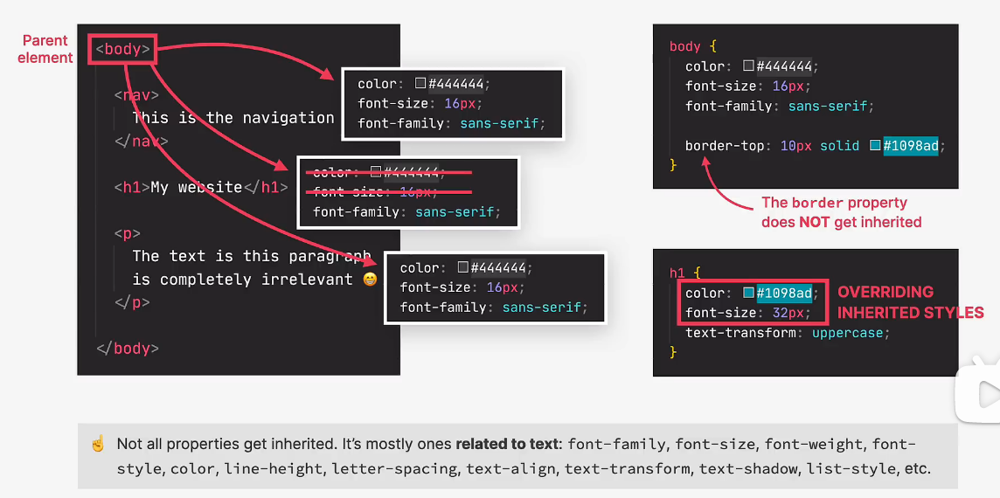
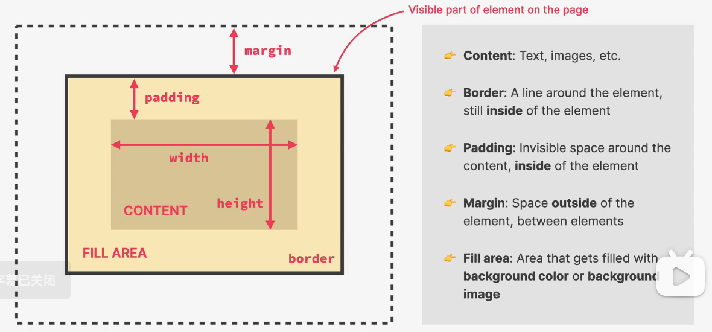
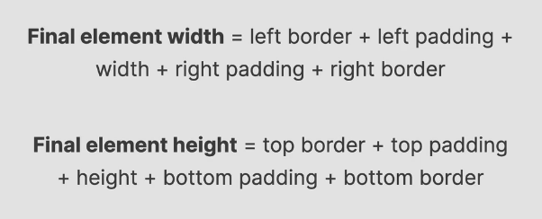
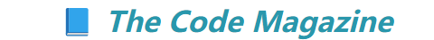
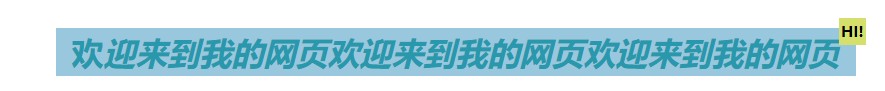
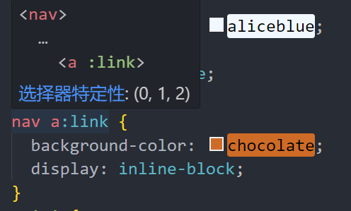
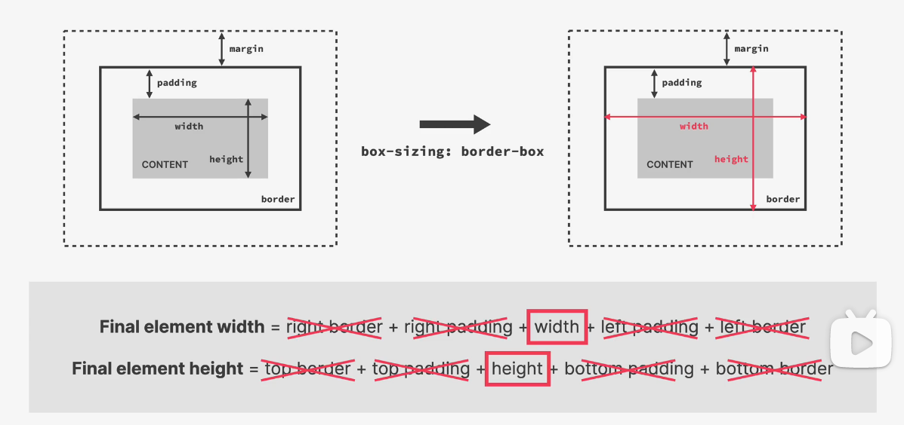
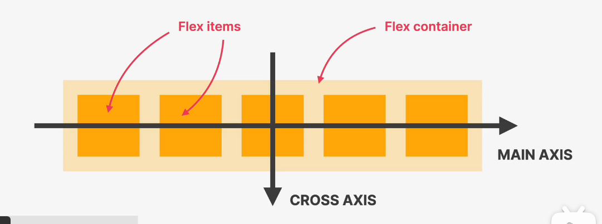
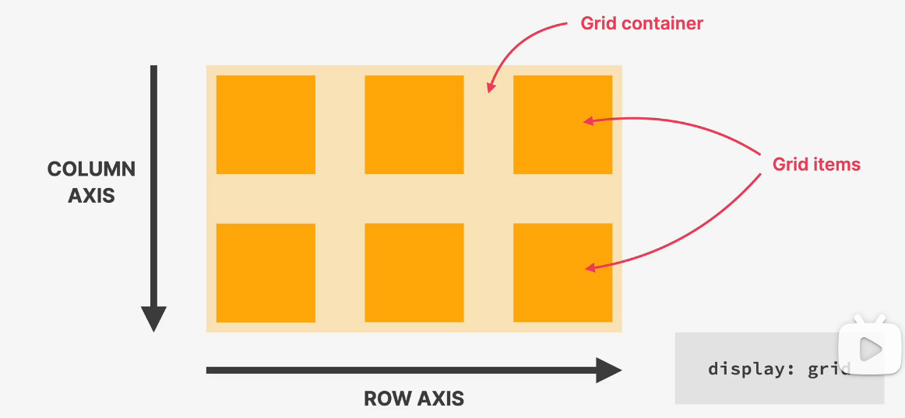

# CSS

_CSS 有三种写法：内联、内部、外部。通常使用外部样式表更便于整理代码。_

## 内联：

_在 HTML 元素的 style 属性中直接定义 CSS 样式_

```html
<p style="color: brown">
  All modern websites and web applications are built using three fundamental
  technologies: HTML, CSS and JavaScript. These are the languages of the web.
</p>
```

## 内部：

_在 HTML 文件中使用标签定义样式，可以统一控制该 HTML 文件中的元素样式_

```html
<style>
  h1 {
    color: brown;
  }
</style>
```

## 外部：

_创建一个单独的 CSS 文件，通过链接引入 HTML 文件后编写样式_

在 HTML 中建立链接：

```html
<link href="style.css" rel="stylesheet" />
```

在 CSS 文件中控制 HTML 元素的样式：

```css
p {
  color: rgb(127, 163, 255); /* 颜色 */
  font-size: 10px; /* 文字大小 */
  font-family: sans-serif; /* 字体 */
  text-transform: uppercase; /* 大小写 */
  font-style: italic; /* 是否斜体 */
}
h1 {
  line-height: 1.5; /* 行高 */
  text-align: center; /* 文本对齐 */
}
```

​**​\*如何精准控制特定元素的样式：​**​\*

1. 通过嵌套选择器

```css
header h1 {
  font-style: italic; /* 是否斜体 */
}
```

2. 在 HTML 中为元素添加 id 属性，在 CSS 中通过 id 选择器控制

HTML：

```html
<p id="language">
  HTML stands for HyperText Markup Language. It's a markup language that web
  developers use to structure and describe the content of a webpage (not a
  programming language).
</p>
```

CSS：使用#选择器控制指定 id 的元素

```css
#language {
  color: rgb(238, 234, 11); /* 颜色 */
}
```

3. 通过类选择器统一管理样式：

在 HTML 元素中添加 class 属性

​**​\*颜色的定义：​**​\*

通过红、绿、蓝三原色的混合搭配定义颜色，通常使用 RGB 模型或十六进制表示法。

RGB 中的 alpha 通道用于调节透明度，添加透明度后变为 RGBA 模型。

​**​\*设置文字背景颜色：​**​\*

```css
.head-header {
  background-color: #94c8df;
}
```

​**​\*伪类选择器：​**​\*

使用 VS Code 等编辑器可以自动提示可用的伪类选择器。

例如：

```css
li:first-child {
  text-transform: uppercase; /* 首行文本大写 */
}
```

这个样式会使所有列表中第一项的文本变为大写。

​**​\*链接样式修饰：​**​\*

```css
a:link {
  color: blueviolet;
  text-decoration: none;
}
```

设置 a:link 伪类，只对有链接的时候才修饰

​**​\*悬停：​**​\*

```css
a:hover {
  color: olivedrab;
  font-weight: bold;
  text-decoration: underline olive;
}
```

​**​\*点击时反应：​**​\*

```css
a:active {
  background-color: aqua;
  font-style: italic; /*变斜体*/
}
```

**_理论知识：_**

当 css 中多个修饰指向同一个 html 元素的时候

无敌关键字！important>内联在 html 中直接定义>id(#)>class(.)>p\ls>通用\*

但当出现多个同级的时候只有最后一个修饰的语句有效

## 继承：


当对`<body>`元素设置 CSS 样式后，这些样式属性会继承给其包含的其他元素，如`<nav>`、`<h1>`等。但并非所有属性都可以继承，例如边框属性就不会被继承。

​**​*HTML 文档结构*​**​

```html
<html>
  <head>
    <header></header>
  </head>
  <body>
    <article></article>
    <aside></aside>
    <footer></footer>
  </body>
</html>
```

1. ​**`<head>`与`<body>`的区别**​

- `<head>`: 包含元数据，不会显示在页面中
- `<body>`: 包含所有可见内容

2. ​**语义化标签的正确使用**​

- `<header>`: 通常用于介绍性内容或导航
- `<article>`: 独立的自包含内容
- `<aside>`: 与周围内容相关但不是主要内容
- `<footer>`: 通常包含作者信息、版权数据等

3. ​**文档完整性**​

- 始终包含`<!DOCTYPE html>`
- 指定语言属性(`lang`)

​**​*CSS 盒子模型*​**​


网页中所有元素都可以视为一个盒子，包含内容、内边距、边框和外边距。

- ​**content**: 内容区域
- ​**width/height**: 内容的宽度和高度
- ​**border**: 边框
- ​**padding**: 内容与边框之间的距离
- ​**margin**: 外边距，控制元素之间的距离
- ​**FILL AREA**: 整个元素的背景填充区域

元素的宽度与高度计算：

​**​*全局边距和填充重置*​**​

通常在 CSS 初始设置时进行：

```css
* {
  margin: 0;
  padding: 0;
}
```

​**​*外边距合并*​**​

当两个相邻元素的边距重叠时，浏览器会采用较大的那个边距值，而不是将两者相加。

​**​*CSS 中的 inline、inline-block 和 block*​**​

### `inline`（行内元素）

- ​**特点**​：
  - 与其他行内元素在同一行显示
  - 无法设置宽度和高度，由内容决定
  - 水平方向的内外边距有效，垂直方向不影响布局
  - 常见元素：`<span>`、`<a>`、`<strong>`、`<em>`

### `block`（块级元素）

- ​**特点**​：
  - 独占一行，自动换行
  - 可以设置宽度、高度、内外边距
  - 默认宽度为父容器的 100%
  - 常见元素：`<div>`、`<p>`、`<h1>-<h6>`、`<ul>`、`<li>`

### `inline-block`（行内块级元素）

- ​**特点**​：
  - 与其他行内元素在同一行显示
  - 可以设置宽度、高度、内外边距
  - 默认宽度由内容决定
  - 常见元素：``、`<input>`、`<button>`

### 主要区别总结

| 特性         | `inline`   | `block`   | `inline-block` |
| ------------ | ---------- | --------- | -------------- |
| 是否独占一行 | 否         | 是        | 否             |
| 宽度         | 由内容决定 | 默认 100% | 由内容决定     |
| 高度         | 不可设置   | 可设置    | 可设置         |
| 内外边距     | 仅水平有效 | 全部有效  | 全部有效       |
| 典型应用     | 文本、链接 | 布局容器  | 按钮、图片     |

### 类型转换

```css
.element {
  display: 目标类型;
}
```

​**​*定位*​**​

定位方式分为 Normal Flow（普通流）和 Absolute Positioning（绝对定位）

## 1. Normal Flow（普通流/文档流）

- 浏览器默认布局方式
- 元素按照 HTML 顺序依次排列

## 2. Absolute Positioning（绝对定位）

- 脱离文档流
- 相对于最近的非静态定位祖先元素定位
- 要使绝对定位生效，通常需要将父元素设为`position: relative`

CSS 伪元素

伪元素用于选择元素的特定部分，以双冒号`::`开头。

示例：

```css
h1 {
  font-style: italic;
}
h1::first-letter {
  font-style: normal;
}
```

效果：


### 常见伪元素

1. `::before`: 在元素内容前插入内容
2. `::after`: 在元素内容后插入内容
3. `::first-line`: 选择第一行文本
4. `::first-letter`: 选择第一个字母

注意：

- 伪元素默认为内联元素，如需设置特定参数可转换为`inline-block`
- 伪元素是其父元素的子元素，可通过绝对定位控制位置

示例：

```css
.HIHIHI {
  margin: 30px 0;
  background-color: #94c8df;
  position: relative;
}
.HIHIHI::after {
  content: "HI!";
  background-color: rgb(215, 223, 103);
  color: #000;
  font-size: 15px;
  position: absolute;
  font-style: normal;
  display: inline-block;
  padding: 2px;
  top: -10px;
  right: -10px;
}
```

效果：


## ​**​*伪类与伪元素的区别*​**​

- ​**伪类(Pseudo-classes)​**:
  - 选择元素的特定状态
  - 以单冒号`:`开头，如`:hover`、`:nth-child()`
- ​**伪元素(Pseudo-elements)​**:
  - 选择元素的特定部分
  - 以双冒号`::`开头，如`::before`、`::first-line`

​**​*CSS 选择器优先级*​**​


优先级服从复杂度高的选择器。在开发工具中将鼠标悬停在选择器上可查看其优先级：

​**​*布局方式：float、flexbox 和 CSS Grid*​**​

### Float 布局

传统布局方式，最初用于文字环绕图片效果。使用浮动时，元素会脱离文档流。

特点：

1. 脱离文档流但仍影响其他元素布局
2. 非浮动内容会环绕浮动元素
3. 宽度收缩到内容宽度（除非指定明确宽度）

缺点：会导致父元素高度塌陷

#### 解决高度塌陷的方法

1. ​**空元素法**​：

```html
<header class="main-header">
  <h1>📘 The Code Magazine</h1>
  <nav>
    <a href="blog.html">Blog</a>
    <a href="#">Challenges</a>
    <a href="#">Flexbox</a>
    <a href="#">CSS Grid</a>
  </nav>
  <div class="clear"></div>
</header>
```

2. ​**clearfix 法**​：

```html
<header class="main-header clearfix">
  <!-- 内容 -->
</header>
```

```css
.clearfix::after {
  content: "";
  display: block;
  clear: both;
}
```

### 环绕效果

非浮动内容会环绕浮动元素，可通过`clear: both`清除环绕

### box-sizing: border-box

```css
box-sizing: border-box;
```


默认行为 (`content-box`)

默认情况下 (`box-sizing: content-box`)，元素的宽度和高度只包括内容区域：

```markdown
总宽度 = width + padding + border
总高度 = height + padding + border
```

## `border-box`  行为

当设置为  `box-sizing: border-box`  时：

```markdown
总宽度 = width (包含 padding 和 border)
总高度 = height (包含 padding 和 border)
```

换句话说，你设置的  `width`  和  `height`  值会包含内容、内边距(padding)和边框(border)。

​**注意**​：`box-sizing: border-box`  不会继承，所以需要通过通用选择器来设置，这通常是 CSS 开发的第一步：

```css
* {
  margin: 0;
  padding: 0;
  box-sizing: border-box;
}
```

## Flexbox：解决浏览器中空白布局问题


使用方法：

1. 创建一个 flex 容器，设置  `display: flex`
2. 容器中的直接子元素会自动成为 Flex 项目

## 容器属性

### 1. 启用 Flex 布局

```markdown
.flex-container {
display: flex; /_ 或 inline-flex _/}
```

### 2. 主轴方向 (`flex-direction`)

```markdown
.flex-container {
flex-direction: row | row-reverse | column | column-reverse;
}
```

### 3. 换行方式 (`flex-wrap`)

```markdown
.flex-container {
flex-wrap: nowrap | wrap | wrap-reverse;
}
```

### 4. 主轴对齐 (`justify-content`)

```markdown
.flex-container {
justify-content: flex-start | flex-end | center | space-between | space-around | space-evenly;
}
```

### 5. 交叉轴对齐 (`align-items`)

```markdown
.flex-container {
align-items: stretch | flex-start | flex-end | center | baseline;
}
```

### 6. 多行对齐 (`align-content`)

```markdown
.flex-container {
align-content: stretch | flex-start | flex-end | center | space-between | space-around;
}
```

## 项目属性

### 1. 项目排序 (`order`)，默认为 0

```markdown
.flex-item {
order: <integer>; /_ 默认 0 _/}
```

### 2. 放大比例 (`flex-grow`)，控制元素是否允许增长

```markdown
.flex-item {
flex-grow: <number>; /_ 默认 0 _/}
```

### 3. 缩小比例 (`flex-shrink`)，控制元素是否允许缩小

```markdown
.flex-item {
flex-shrink: <number>; /_ 默认 1 _/}
```

### 4. 基础大小 (`flex-basis`)，通常替代宽度设置

```markdown
.flex-item {
flex-basis: <length> | auto; /_ 默认 auto _/}
```

### 5. 简写属性 (`flex`)，等同于  `flex-grow` + `flex-shrink` + `flex-basis`

```markdown
.flex-item {
flex: none | [ <'flex-grow'> <'flex-shrink'>? || <'flex-basis'> ];
/_ 推荐写法：flex: 1 1 200px; _/}
```

### 6. 单个项目对齐 (`align-self`)

```markdown
.flex-item {
align-self: auto | flex-start | flex-end | center | baseline | stretch;
}
```

| ​**特性**​     | ​**容器属性**​    | ​**项目属性**​    |
| -------------- | ----------------- | ----------------- |
| ​**作用对象**​ | 父元素(flex 容器) | 子元素(flex 项目) |
| ​**主要功能**​ | 控制整体布局行为  | 控制单个项目表现  |
| ​**应用场景**​ | 定义布局规则      | 定义项目具体表现  |
| ​**属性数量**​ | 6 个主要属性      | 6 个主要属性      |

注意：当父元素设置为 flex 时，只会影响其直接子元素（第一级子元素）的布局。

## CSS Grid：强大的二维布局系统


启用方法：`display: grid`

## 基本概念

### 容器属性

```markdown
.container {
display: grid; /_ 或 inline-grid _/ grid-template-columns: 100px 200px auto; /_ 定义列 _/ grid-template-rows: 50px 100px; /_ 定义行 _/ gap: 10px; /_ 行列间距 _/}
```

### 常用容器属性

1. ​**`grid-template-columns` / `grid-template-rows`**​

- 定义网格的列和行大小
- 示例：

  ```markdown
  grid-template-columns: 1fr 2fr 1fr; /_ 分数单位 _/grid-template-rows: repeat(3, 100px); /_ 重复模式 _/
  ```

2. ​**`gap`**​ (替代了  `grid-gap`)

- 可以单独设置行间距(`row-gap`)和列间距(`column-gap`)
- 示例：

  ```markdown
  gap: 20px; /_ 行列间距相同 _/gap: 10px 20px; /_ 行间距 10px，列间距 20px _/
  ```

3. ​**`justify-items` / `align-items`**​

- 控制网格项在单元格内的对齐方式

### 网格项属性

1. ​**`grid-column` / `grid-row`**​

- 定义项目占据的网格线
- 示例：

  ```markdown
  .item {
  grid-column: 1 / 3; /_ 从第 1 列线到第 3 列线 _/ grid-column: 1 / span 2; /_ 从第 1 列线开始，跨越 2 列 _/ grid-column: 1 / -1; /_ 从第 1 列线到最后列线 _/ grid-row: 1; /_ 只占据第 1 行 _/}
  ```

## 实用示例

### 1. 基础网格布局

```css
.container {
  display: grid;
  grid-template-columns: repeat(3, 1fr);
  gap: 10px;
}
```

### 2. 响应式布局

```css
.container {
  display: grid;
  grid-template-columns: repeat(auto-fill, minmax(200px, 1fr));
}
```

### 3. 复杂布局

```css
.container {
  display: grid;
  grid-template-columns: 200px 1fr;
  grid-template-rows: 80px 1fr 60px;
  grid-template-areas:
    "header header"
    "sidebar content"
    "footer footer";
  height: 100vh;
}

.header {
  grid-area: header;
}
.sidebar {
  grid-area: sidebar;
}
.content {
  grid-area: content;
}
.footer {
  grid-area: footer;
}
```

## Grid vs Flexbox

| ​**特性**​ | ​**CSS Grid**​ | ​**Flexbox**​ |
| ---------- | -------------- | ------------- |
| 维度       | 二维布局       | 一维布局      |
| 应用场景   | 整体页面布局   | 组件内部布局  |
| 对齐控制   | 行列同时控制   | 单轴控制      |
| 重叠       | 原生支持       | 需要额外处理  |

# CSS Grid 中的  `fr`  单位详解

`fr`  是 CSS Grid 中专用的弹性单位，表示"fraction"(分数)，用于按比例分配可用空间。

## 基本概念

- ​**`fr`**​ 表示网格容器中可用空间的一部分
- 仅用于  `grid-template-columns`  和  `grid-template-rows`  属性
- 与其他单位(px, %, em 等)混合使用时特别有用

## 使用方法

### 1. 基本比例分配

```css
.container {
  display: grid;
  grid-template-columns: 1fr 2fr 1fr; /* 三列，中间列是两侧的两倍宽 */
}
```

### 2. 与其他单位混合

```css
.container {
  display: grid;
  grid-template-columns: 300px 1fr 2fr; /* 第一列固定300px，剩余空间按1:2分配 */
}
```

### 3. 多 fr 单位

```css
.container {
  display: grid;
  grid-template-columns: 1fr 1fr 1fr; /* 三等分 */
  grid-template-rows: 2fr 1fr; /* 第一行高度是第二行的两倍 */
}
```

## 重要特性

1. ​**剩余空间分配**​

- `fr`  单位只分配容器减去所有固定尺寸后的剩余空间

2. ​**最小内容限制**​

- 即使使用  `fr`  单位，网格轨道也不会小于其内容的最小尺寸

3. ​**与  `minmax()`  结合**​

- 可以创建更灵活的布局：

  ```css
  grid-template-columns: minmax(200px, 1fr) 2fr;
  ```

4. ​**负空间处理**​

- 如果固定尺寸总和超过容器尺寸，`fr`  轨道会压缩到 0（除非使用  `minmax()`  限制）

## 实用示例

### 响应式侧边栏布局

```css
.layout {
  display: grid;
  grid-template-columns: minmax(200px, 1fr) 4fr;
  gap: 20px;
}
```

### 画廊布局

```css
.gallery {
  display: grid;
  grid-template-columns: repeat(auto-fill, minmax(250px, 1fr));
  gap: 15px;
}
```

## 常见问题

1. ​**`fr` vs `%`**​

- `%`  是基于容器尺寸的百分比
- `fr`  是基于可用空间的分配比例

2. ​**为什么  `fr`  列不等宽？​**​

- 检查内容是否强制扩展了某一列（添加  `min-width: 0`  可以解决）

3. ​**IE11 支持**​

- IE11 不支持  `fr`  单位，需要使用  `-ms-grid`  和百分比替代

> `fr`  单位是 Grid 布局中创建灵活、响应式设计的关键工具，特别适合需要按比例分配空间的场景。

## `justify`  系列属性

控制**主轴方向**的对齐：

| 属性              | 作用范围          | 描述                             |
| ----------------- | ----------------- | -------------------------------- |
| `justify-content` | 容器              | 控制所有项目的整体主轴对齐       |
| `justify-items`   | 容器（Grid 专用） | 控制网格项目在单元格内的主轴对齐 |
| `justify-self`    | 单个项目          | 控制单个项目在单元格内的主轴对齐 |

### 常用值：

```css
.container {
  justify-content: flex-start | flex-end | center | space-between | space-around
    | space-evenly;
}
```

## `align`  系列属性

控制**交叉轴方向**的对齐：

| 属性            | 作用范围 | 描述                              |
| --------------- | -------- | --------------------------------- |
| `align-items`   | 容器     | 控制所有项目的交叉轴对齐          |
| `align-content` | 容器     | 控制多行/多列在交叉轴上的整体对齐 |
| `align-self`    | 单个项目 | 控制单个项目的交叉轴对齐          |

### 常用值：

```css
.container {
  align-items: stretch | flex-start | flex-end | center | baseline;
}
```

## 实际应用示例

### Flexbox 示例

```css
.flex-container {
  display: flex;
  justify-content: center; /* 主轴居中 */
  align-items: center; /* 交叉轴居中 */
  height: 300px;
}
```

### Grid 示例

```css
.grid-container {
  display: grid;
  justify-items: center; /* 所有项目在单元格内水平居中 */
  align-items: end; /* 所有项目在单元格内底部对齐 */
  grid-template-columns: repeat(3, 1fr);
  height: 200px;
}
```

## 记忆技巧

1. ​**justify = 主轴**​

- 联想："justify text"（文本对齐）通常是水平方向的

2. ​**align = 交叉轴**​

- 联想："vertical-align"（垂直对齐）

3. ​**content**​

- 控制项目组在容器中的整体分布

4. ​**items**​

- 控制所有项目在各自区域内的对齐

5. ​**self**​

- 覆盖单个项目的对齐方式

链接伪类详解

### 常用链接伪类对比

| 伪类       | 作用       | 示例                                     | 使用场景     |
| ---------- | ---------- | ---------------------------------------- | ------------ |
| `:link`    | 未访问链接 | `a:link { color: blue; }`                | 初始链接样式 |
| `:visited` | 已访问链接 | `a:visited { color: purple; }`           | 访问过的链接 |
| `:hover`   | 鼠标悬停   | `a:hover { text-decoration: none; }`     | 交互反馈     |
| `:active`  | 激活状态   | `a:active { color: red; }`               | 点击瞬间效果 |
| `:focus`   | 键盘聚焦   | `a:focus { outline: 2px solid orange; }` | 无障碍访问   |

> ​**最佳实践**​：建议按 LVHA 顺序定义（`:link` → `:visited` → `:hover` → `:active`）

## CSS `box-shadow`  属性详解

### 基本语法

```css
box-shadow: [水平偏移] [垂直偏移] [模糊半径] [扩展半径] [颜色] [inset];
```

### 参数说明

| 参数     | 描述     | 必需 | 示例值      |
| -------- | -------- | ---- | ----------- |
| 水平偏移 | 正右负左 | 是   | `10px`      |
| 垂直偏移 | 正下负上 | 是   | `5px`       |
| 模糊半径 | 模糊程度 | 否   | `3px`       |
| 扩展半径 | 阴影大小 | 否   | `2px`       |
| 颜色     | 阴影颜色 | 否   | `#00000080` |
| inset    | 内阴影   | 否   | `inset`     |

### 实用示例

```css
/* 外阴影 */
.shadow {
  box-shadow: 3px 3px 5px 1px rgba(0, 0, 0, 0.3);
}

/* 内阴影 */
.inset-shadow {
  box-shadow: inset 0 0 10px #000;
}

/* 多重阴影 */
.multi-shadow {
  box-shadow: 0 2px 5px rgba(0, 0, 0, 0.1), 0 5px 15px rgba(0, 0, 0, 0.2);
}
```

## CSS `border-radius`  属性详解

### 语法变体

```css
/* 统一圆角 */
.rounded {
  border-radius: 8px;
}

/* 对角对称 */
.diagonal {
  border-radius: 10px 20px;
}

/* 三值语法 */
.three-values {
  border-radius: 5px 10px 15px;
}

/* 全角独立 */
.full-control {
  border-radius: 5px 10px 15px 20px;
}

/* 椭圆角 */
.ellipse {
  border-radius: 50% / 20%;
}

/* 单独控制 */
.independent {
  border-top-left-radius: 10px;
  border-bottom-right-radius: 15px;
}
```

### 高级技巧

1. ​**圆形元素**​：

```css
.circle {
  width: 100px;
  height: 100px;
  border-radius: 50%;
}
```

2. ​**胶囊按钮**​：

```css
.pill {
  border-radius: 9999px;
}
```

## Transform 居中技巧

### 工作原理

1. `top: 50%`  和  `left: 50%`  将元素左上角定位到父容器中心
2. `transform: translate(-50%, -50%)`  通过元素自身尺寸修正位置

```css
.center {
  position: absolute;
  top: 50%;
  left: 50%;
  transform: translate(-50%, -50%);
}
```

### 参数说明

| 代码                               | 作用                     |
| ---------------------------------- | ------------------------ |
| `left: 50%`                        | 相对于父容器水平居中     |
| `top: 50%`                         | 相对于父容器垂直居中     |
| `transform: translate(-50%, -50%)` | 基于元素自身尺寸修正位置 |

> ​**注意**​：此方法需要元素设置  `position: absolute/fixed`

## 改变背景图片渐变：

```css
background-image: linear-gradient(rgba(0, 0, 0, 0.082), rgba(0, 0, 0, 0.6)),
  url(hero.jpg);
```
