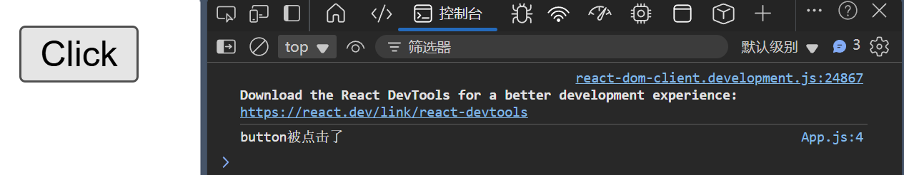
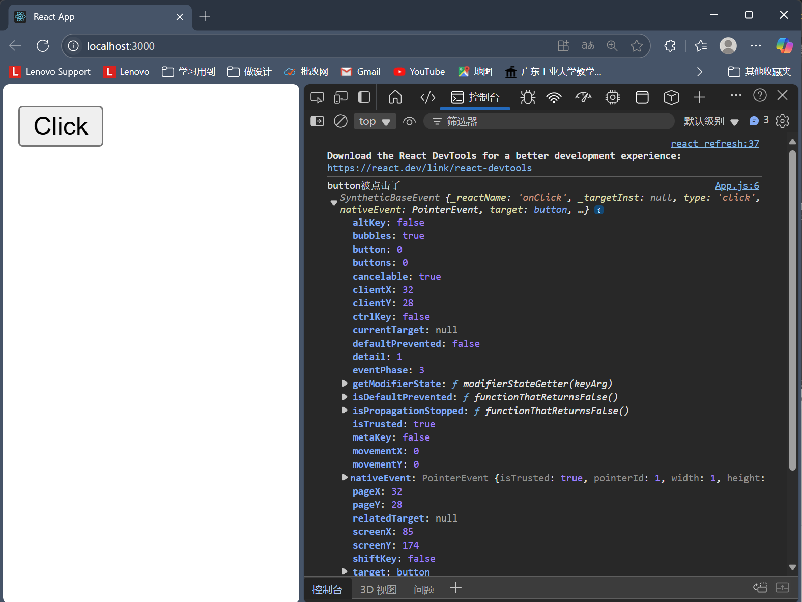
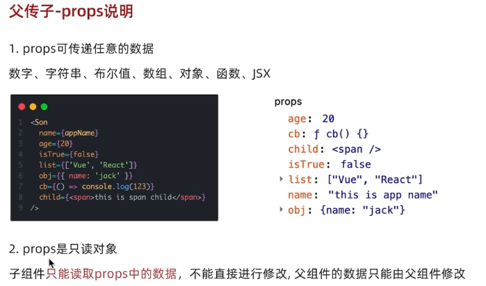
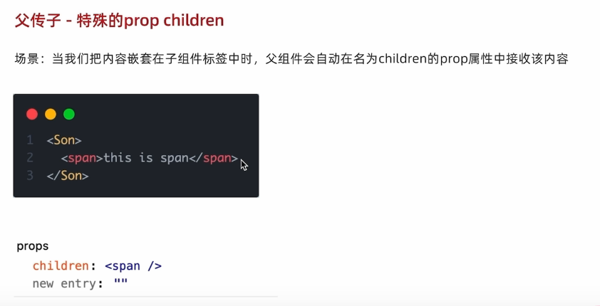
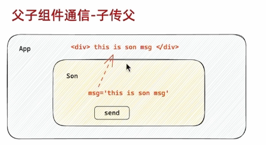
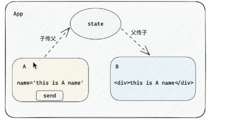
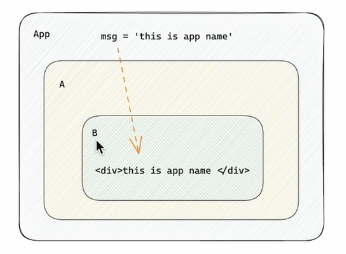
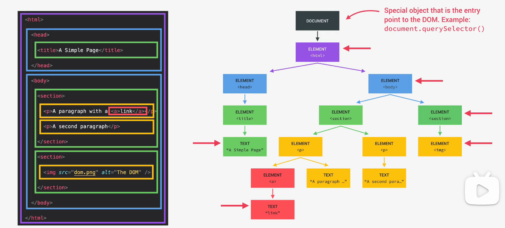
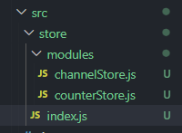
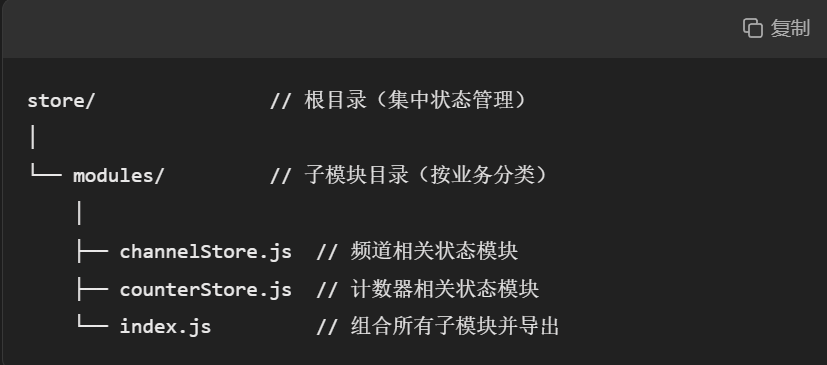

# React 框架

react 组件就是返回值类似于 HTML 的 JSX 代码的 函数

组件命名开头是大写的，html 文件开头是小写

# 搭建开发环境：

CRA：

执行命令：

<mark>npx create-react-app react-basic</mark>

1、npx 是 Node.js 工具命令，查找并执行后续的包命令

2、create-react-app 核心包（固定写法），用于创建 React 项目

3、react-basic React 项目的名称（可自定义）

# 如何先让项目跑起来

在终端
cd 项目名称

npm run start

JXS（兼具 HTML 的模板结构和 JS 的代码的 JS 扩展）

它是 React 中编写 UI 模板的方法

层级

# App.js 是项目的根组件

# index.js 属于是项目的入口，从这里开始导入 React 必要的核心包和项目的根组件（App.js），并且把 App 根组件渲染到 id 为 root 的

# JSX 模板基础

在 JSX 中可以通过 大括号语法{ }识别 JavaScript 中的表达式，比如常见的变量、函数调用、方法调用等等

## 1.使用引号传递字符串

## 2.使用 JavaScript 变量

## 3.函数调用和方法调用

## 4.使用 JavaScript 对象

```jsx
const count = 100;
const getname = function () {
  return "jack";
};
function App() {
  return (
    <div className="App">
      this is app{"这个属于纯文本"}
      {/*使用引号传递字符串*/}
      {"这是一段字符串"}
      {/*使用JS变量*/}
      {count}
      {/*使用函数调用*/}
      {getname()}
      {/*使用方法调用*/}
      {new Date().getDate}
      {/*使用js对象*/}
      <div style={{ color: "red" }}>a new color show</div>
    </div>
  );
}

export default App;
```

# JSX 实现列表渲染（通常用 map 实现）

在 React 渲染列表时，​**必须为每个子元素提供一个唯一的  `key`  属性**，react 內部用于提高渲染性能。

```jsx
const list = [
  { id: 1, name: "chen" },
  { id: 2, name: "zhou" },
  { id: 3, name: "liu" },
];
function App() {
  return (
    <div className="App">
      <ul>
        {list.map((item) => (
          <li key={item.id}>{item.name}</li> //必须为每一个item绑定一个独一无二的key
        ))}
      </ul>
    </div>
  );
}

export default App;
```

# JSX 中如何实现条件渲染

## 基础条件渲染（逻辑与运算符&&、三元表达式）

```jsx
const isLogin = true;
function App() {
  return (
    <div className="App">
      {/*逻辑与运算符 */}
      {isLogin && <span>this is span</span>}
      {/*三元运算符*/}
      {isLogin ? <span>trun show</span> : <span>show</spn>}
    </div>
  );
}

export default App;
```

# 复杂条件实现条件渲染

使用 if 等实现

```jsx
const articleType = 1;
function getarticleType() {
  if (articleType === 0) {
    return <div>我是0的情况</div>;
  } else if (articleType === 1) {
    return <div>我是1的情况</div>;
  }
}
function App() {
  return <div className="App">{getarticleType()}</div>;
}

export default App;
```

# react 中的事件绑定

基础事件绑定：切记不可以变成

```jsx
<button onClick={handleClick}>Click</button>
```

这里在事件绑定时直接调用了函数而不是传递函数引用

_语法：on+事件名称 = { 事件处理程序 }，整体上遵循驼峰命名法_

```jsx
function App() {
  const handleClick = function () {
    console.log("button被点击了");
  };
  return (
    <div className="App">
      <button onClick={handleClick}>Click</button>
    </div>
  );
}

export default App;
```



## 使用事件对象参数 e

在前端开发中，`e`  是事件对象（event object）的常用缩写参数名。当你在 JavaScript 中绑定事件处理函数时，这个  `e`  参数会自动传递给函数，包含关于该事件的所有重要信息。

语法：在事件回调函数中设置行参 e（在括号中填入 e）

```jsx
const handleClick = function (e) {
  console.log("button被点击了", e);
};
function App() {
  return (
    <div className="App">
      <button onClick={handleClick}>Click</button>
    </div>
  );
}

export default App;
```



# 如何在绑定事件中传递自定义参数

将事件绑定部分设置成箭头函数，然后在点击时候再调用在箭头函数中的函数，避免在渲染时直接触发该事件函数。

# 理解 React 事件处理中的箭头函数语法

这个语法确实看起来有点复杂，我来一步步解释为什么可以这样写，以及它的语法规则。

## 基础概念

在 JSX 中，`onClick`  等事件属性需要接收一个函数作为值。大括号  `{}`  在 JSX 中表示"这里要插入 JavaScript 表达式"。

## 几种常见写法对比

### 1. 直接传递函数引用（最简单形式）

```jsx
<button onClick={handleClick}>Click</button>
```

- 直接把  `handleClick`  函数赋给  `onClick`
- 点击时，React 会自动将事件对象  `e`  传给  `handleClick`

### 2. 使用箭头函数包装（需要传额外参数时）

```jsx
<button onClick={(e) => handleClick(e, "额外参数")}>Click</button>
```

- 这里创建了一个新的箭头函数  `(e) => handleClick(e, '额外参数')`
- 当点击时，React 将事件对象  `e`  传给这个箭头函数
- 然后箭头函数再调用  `handleClick`，并传递  `e`  和你的额外参数

## 语法分解

让我们分解这个结构：

```jsx
onClick={(e) => handleClick(e, '额外参数')}
```

1. ​ 外层大括号  `{}`​：表示里面是 JavaScript 表达式
2. 箭头函数  `(e) => ...`​：创建一个新函数，参数是  `e`（事件对象）
3. ​ 函数体  `handleClick(e, '额外参数')`​：调用你定义的  `handleClick`，并传递两个参数

## 为什么需要这样写？

因为如果你直接写成这样是**错误的**​：

```jsx
<button onClick={handleClick(e, "额外参数")}>Click</button>
```

（这会在渲染时立即调用函数，而不是在点击时调用）

箭头函数在这里的作用是"延迟执行"——它创建了一个新函数，这个新函数会在点击时执行，然后才调用你的  `handleClick`  并传递参数。

## 类比理解

可以想象成：

```js
// 错误的：直接调用
button.onclick = handleClick(e, "参数"); // 立即执行

// 正确的：创建一个新函数
button.onclick = function (e) {
  handleClick(e, "参数"); // 点击时才执行
};

// 用箭头函数简写
button.onclick = (e) => handleClick(e, "参数");
```

# REACT 的组件（组件化开发可以让开发者像搭积木一样搭建一个完整的庞大的应用）

一个组件就说用户界面的一个部分，它可以有组件的逻辑和外观，组件之间要看互相嵌套，也可以复用多次

在 react 中，一个组件就是**首字母大写的函数**，**内部存放了组件的逻辑和视图 UI**，渲染组件只需要**把组件当作标签书写即可**

```jsx
//自定义组件
function Button() {
  //组件的业务逻辑
  return <button>click me!</button>;
}
function App() {
  return (
    <div className="App">
      {/*可以使用自闭和来触发*/}
      <Button />
      {/*也可以使用成对标签触发*/}
      <Button></Button>
    </div>
  );
}

export default App;
```

# useState（使用前需先 import 调用）

import { useState } from ‘react’

useState 是一个 React Hook（函数），它允许我们向组件添加一个**状态变量（count）**，从而控制影响组件的渲染结果

和普通 js 变量不同的是，状态变量（count）一旦发生变化，组件的视图 UI 也会跟着变化（数据驱动视图）

## 大致语法：

**_<mark>const [ count , setCount ] = useState(0)</mark>_**

1、useState 是一个函数，返回值是一个数组

2、数组中的第一个参数是状态变量，第二个参数是 set 函数用来修改状态变量

3、useState 的参数将作为 count 的初始值

```jsx
//使用useState做一个计数器按钮
//在react库中导入useState函数
import { useState } from "react";
function App() {
  //调用useState生成一个状态变量count和改变状态变量的方法setCount
  //useState返回的是一个数组
  const [count, setCount] = useState(0);
  const handleClick = () => {
    //作用：用传入的新数值修改count
    //重新使用新的count渲染UI
    setCount(count + 1);
  };
  return (
    <div className="App">
      <button onClick={handleClick}>{count}</button>
    </div>
  );
}
export default App;port default App;
```

# 修改状态的规则

在 react 中，**状态被认为是只读的，我们应该始终替换它而不是修改它**（定义 count 的时候使用 const 而不是 let），直接修改状态不能引发视图更新，必须调用 setCount

# 如何实现修改对象状态

使用新值替换老值，使用 setForm 来改变状态

```jsx
//在react库中导入useState函数
import { useState } from "react";
function App() {
  const [Form, setForm] = useState({ name: "chen", age: 18 });
  const changeForm = (newname) => {
    //错误写法：
    //Form.name = "zhou";
    //正确写法：
    setForm({ ...Form, name: newname });
  };
  return (
    <div className="App">
      <button onClick={() => changeForm("zhou")}>名字为：{Form.name}</button>
    </div>
  );
}

export default App;
```

# 组件的基础样式控制方案

1、行内控制（不推荐）

```jsx
function Button() {
  return (
    <button
      style={{
        padding: "10px 20px",
        backgroundColor: "blue",
        color: "white",
        border: "none",
        borderRadius: "4px",
      }}
    >
      点击我
    </button>
  );
}
```

2、class 类名控制，也就是创建一个 css 类（推荐）

使用 css 样式表

```css
/* Button.css */
.button {
  padding: 10px 20px;
  background-color: blue;
  color: white;
  border: none;
  border-radius: 4px;
}
```

```jsx
// Button.js
import "./Button.css";

function Button() {
  return <button className="button">点击我</button>;
}
```

#

# 受控表单绑定

概念：使用 React 组件的状态（useState）来控制表单的状态

```jsx
import { useState } from "react";

function App() {
  //声明一个useState
  const [value, setValue] = useState("");
  return (
    <div className="App">
      <input
        //在input中定义他的属性
        type="text" //文本
        value={value} //将input的value让useState的状态来控制
        onChange={(e) => setValue(e.target.value)} //onchange是监听用户输入的，每次输入选择切换的时候就会被触发，将其获取到的信息传递给useState中的set函数来更新状态，然后因为value绑定的就是对应的状态，所以得以更新了哈哈哈
      />
    </div>
  );
}

export default App;
```

# React 中获取 DOM（大部分时候不需要）

需要使用到 useRef 钩子函数分为两步

1. 使用 useRef 创建 ref 对象，并且与 JSX 绑定

2. 在 DOM 可用时，通过 inputRef.current 拿到 DOM 对象

```jsx
import { useRef, useState } from "react";

function App() {
  //声明一个useRef
  const inputRef = useRef(null);
  const showDom = () => {
    console.log(inputRef.current);
  };
  return (
    <div className="App">
      <input type="text" ref={inputRef} />
      <button onClick={showDom}>获取DOM</button>
    </div>
  );
}

export default App;
```

inputRef.current 显示的是 ​**当前输入框的真实 DOM 元素**

步骤解析：

1. ​**创建 ref 对象**​：

```javascript
const inputRef = useRef(null); // 初始化为 null
```

2. ​**绑定到组件的  `ref`  属性**​：

```jsx
<input ref={inputRef} />
```

3. ​React 自动填充  `.current`​：

- 组件 ​**挂载（mount）​**​ 时，React 将 DOM 节点赋值给  `inputRef.current`。
- 组件 ​**卸载（unmount）​**​ 时，React 将  `inputRef.current`  重置为  `null`。

#### 底层机制：

- React 在处理 JSX 时，检测到  `ref`  属性后，会在 ​**渲染完成后**​ 自动将对应的 DOM 节点或类组件实例赋值给  `ref.current`。

#### 阶段 2：DOM 创建阶段

当 React 真正创建 DOM 元素时：

1. 创建真实的  `<input>` DOM 节点。
2. ​**检查 props 中的  `ref`  属性**，发现它是一个  `ref`  对象（由  `useRef`  创建）。
3. ​**自动将 DOM 节点赋值给  `inputRef.current`**。

#### 阶段 3：卸载时的清理

如果组件卸载，React 会将  `inputRef.current`  重置为  `null`。

# 组件通信

组件之间的数据传递，根据组件嵌套关系的不同有不同的通信方法

## 父子通信（将父组件传递给子组件）

1. 父组件传递数据——在子组件标签上绑定元素

2. 子组件接收数据——子组件通过 props 参数接收数据

```jsx
import { useRef, useState } from "react";
function Son(props) {
  //props包含的是父组件传递过来的全部数据
  return <div>I am son {props.a2}</div>;
}

function App() {
  const a1 = "this name from fa";
  return (
    <div className="App">
      <Son a2={a1} />
      {/*在子组件上选好绑定的元素 */}
    </div>
  );
}

export default App;
```

命名规则：

| 位置         | 命名权                     | 示例                        | 结果                 |
| ------------ | -------------------------- | --------------------------- | -------------------- |
| ​**父组件**​ | 可自由决定传递时的属性名   | `<Son 自定义名={变量名} />` | 子组件只能用自定义名 |
| ​**子组件**​ | 必须使用父组件定义的属性名 | `props.自定义名`            | 获取正确值           |

# props 说明



## 特殊的 props，当子组件标签内部还有标签的时候，父组件会自动将其放置在命名为 props 的属性中



# 子传父

核心思路：先给子组件传递父组件的函数，再在子组件中调用父组件中的函数并且传递参数


```jsx
import { useRef, useState } from "react";
function Son(props) {
  const sonname = "111";
  //props包含的是父组件传递过来的全部数据
  return (
    <div>
      <button onClick={() => props.funtion1(sonname)}>sent</button>
    </div>
  );
}

function App() {
  const printmessage = (message) => {
    console.log(message);
  };
  return (
    <div className="App">
      <Son funtion1={printmessage} />
      {/*将printmessage方法传递给子组件*/}
    </div>
  );
}

export default App;
```

# 兄弟组件通信

思路：借助“状态提升”，使用共同的父组件进行兄弟组件之间数据传递

1. A 组件先通过子传服方法把数据传给父组件 App

2. App 拿到数据后通过父传子再传给 B 组件



```jsx
import { useState } from "react";
function Son1(props) {
  const son1name = "111";
  //props包含的是父组件传递过来的全部数据
  //通过函数实现子传父数据传递数据给父
  return (
    <div>
      <button onClick={() => props.funtion(son1name)}>setName</button>
    </div>
  );
}
function Son2(props) {
  //props包含的是父组件传递过来的全部数据
  return <div>I get the name from 1 :{props.getname}</div>;
}

function App() {
  //因为涉及状态更新所以创建useState
  const [name, setName] = useState("");
  //创建获取组件1信息的方法
  const get1name = (message) => {
    setName(message); //获取子组件1的数据到状态
  };
  return (
    <div className="App">
      <Son1 funtion={get1name} />
      <Son2 getname={name} />
      {/*将printmessage方法传递给子组件*/}
    </div>
  );
}

export default App;
```

# useContext 的用法

props 的逐层传递当从上到下传递的层级多了的时候显得非常麻烦，不方便。使用 useContext 更好实现数据共享

例子：App 传 Parent 传 Child

```jsx
import { useState } from "react";

function Child(props) {
  const { count, setCount } = props; //当数据源的结构是对象，结构用{}
  return (
    <>
      <h3>子组件 -{count}</h3>
      <button onClick={() => setCount(count + 1)}>+</button>
    </>
  );
}

function Parent(props) {
  const { count, setCount } = props;
  return (
    <>
      <h2>父组件 -{count}</h2>
      <Child count={count} setCount={setCount} />
    </>
  );
}

function App() {
  //解构自定义Hook的return
  const [count, setCount] = useState(0);

  return (
    <div className="App">
      <h1>根组件 -{count}</h1>
      <Parent count={count} setCount={setCount} />
    </div>
  );
}

export default App;
```



1. 使用 createContext（）方法创建一个上下文对象 Ctx

2. 在顶层组件（App）中进行环境配置，通过 Ctx.Provide 组件提供数据 value={ }

3. 在底层组件（B）中通过 useContext 钩子函数，传入上下文对象，获取对应的 value 数据并且解构就可以使用了

```jsx
import { createContext, useContext, useState } from "react";

const Ctx = createContext(); //1、第一步：创建一个上下文对象Ctx
function Child() {
  //3、通过useContext钩子函数，传入上下文对象，获取对应的value数据并且解构就可以使用了
  const { count, setCount } = useContext(Ctx);
  return (
    <>
      <h3>子组件 -{count}</h3>
      <button onClick={() => setCount(count + 1)}>+</button>
    </>
  );
}

function Parent() {
  //3、通过useContext钩子函数，传入上下文对象，获取对应的value数据并且解构就可以使用了
  const { count, setCount } = useContext(Ctx);
  return (
    <>
      <h2>父组件 -{count}</h2>
      <Child count={count} setCount={setCount} />
    </>
  );
}

function App() {
  //解构自定义Hook的return
  const [count, setCount] = useState(0);
  return (
    //2、第二部通过Ctx（环境对象）.Provide来提供数据value
    <Ctx.Provider value={{ count, setCount }}>
      <div className="App">
        <h1>根组件 -{count}</h1>
        <Parent />
      </div>
    </Ctx.Provider>
  );
}

export default App;
```

# 重要：useEffect 函数

useEffect 是一个 React Hook 函数，用于在 React 组件中创建<mark>不是由事件引发而是由渲染本身引起的操作</mark>，比如发送 AJAX 请求，更改 DOM 等等


基本语法：useEffect（（）=> { } ， [ ] ）

参数 1 是一个函数，可以把它叫做副作用函数，在函数内部可以放置要执行的操作

参数 2 是一个数组(可选参)，在数组里放置依赖项，不同依赖项会影响第一个参数函数的执行，当是一个空数组的时候，副作用函数只会在组件渲染完毕后执行一次

```jsx
import { useState, useEffect } from "react";

const URL = "http://geek.itheima.net/v1_0/channels";
function App() {
  const [list, setList] = useState([]);
  useEffect(() => {
    //额外的操作
    async function getList() {
      const res = await fetch(URL);
      const jsonRes = await res.json();
      console.log(jsonRes);
      setList(jsonRes.data.channels);
    }
    getList();
  }, []);
  return (
    <div className="App">
      this is App
      <ul>
        {list.map((item) => (
          <li key={item.id}>{item.name}</li>
        ))}
      </ul>
    </div>
  );
}

export default App;
```

## 为什么这样设计？

- ​**分离关注点**​：`res`  处理网络响应，`jsonRes`  处理数据解析，`useEffect`  处理执行时机
- ​**异步流程清晰**​：`await`  让异步代码看起来像同步代码，易于理解
- ​**React 生命周期控制**​：`useEffect`  确保副作用在正确的时间执行

这种模式是 React 中获取并显示异步数据的标准做法，理解这些概念对你掌握 React 开发非常重要。

# useEffect 依赖项参数说明

## 三种常见依赖项情况

### 情况 1：空依赖数组  `[]`

```javascript
useEffect(() => {
  console.log("我只在组件挂载时执行一次");
}, []); // ← 空数组
```

- ​**执行时机**​：仅在组件首次渲染（挂载）后执行一次
- ​**类比**​：就像手机的开机初始化设置，只在开机时运行一次
- ​**适用场景**​：
  - 数据获取（如示例中的 API 请求）
  - 事件监听器的添加（需要在组件卸载时清理）
  - 只需要执行一次的初始化操作

### 情况 2：无依赖数组（省略第二个参数）

```javascript
useEffect(() => {
  console.log("我每次渲染后都会执行");
}); // ← 没有第二个参数
```

- ​**执行时机**​：每次组件渲染后都会执行
- ​**类比**​：就像手机的屏幕自动亮度调节，每次环境变化都会重新调整
- ​**注意事项**​：
  - 容易导致无限循环（如果副作用中又触发了重新渲染）
  - 使用时要特别小心
- ​**适用场景**​：很少使用，除非你确实需要在每次渲染后都执行某些操作

### 情况 3：有具体依赖项

```javascript
useEffect(() => {
  console.log("当count变化时我会执行", count);
}, [count]); // ← 包含count依赖
```

- ​**执行时机**​：
  - 首次渲染后执行
  - 之后只有当  `count`  的值发生变化时才会重新执行
- ​**类比**​：就像手机的省电模式，只在电量低于某个阈值时才激活
- ​**适用场景**​：
  - 当某个状态/属性变化时需要执行的操作
  - 基于特定值变化的副作用（如根据 ID 获取数据）

# useEffect 清除副作用

`useEffect`  的清除副作用机制是 React 中管理资源的重要特性，它能帮助我们在组件卸载或依赖项变化时正确清理资源，防止内存泄漏和其他问题。

## 什么是清除副作用？

清除副作用指的是在  `useEffect`  中返回一个清理函数，这个函数会在以下两种情况下执行：

1. 组件卸载时（从 DOM 中移除）
2. 执行下一个副作用前（依赖项变化时）

## 基本语法

```javascript
useEffect(() => {
  // 设置或执行某些操作（副作用）

  return () => {
    // 清除副作用的逻辑（清理函数）
  };
}, [dependencies]);
```

## 为什么需要清除副作用？

想象你在图书馆：

- 借书（创建资源） → 副作用
- 还书（释放资源） → 清除副作用  
  如果不还书（不清理），图书馆（内存）的书就会越来越少（内存泄漏）

# 例子：在 Son 组件中渲染时开启一个定时器，卸载时清除这个定时器

# `setInterval()`  函数详解

`setInterval()`  是 JavaScript 中的一个内置函数，用于**周期性重复执行指定的代码**。它是前端开发中实现定时任务的核心工具之一。

## 基本语法

```javascript
const intervalID = setInterval(callback, delay, [arg1, arg2, ...]);
```

- ​**callback**​：要重复执行的函数
- ​**delay**​：每次执行之间的时间间隔（毫秒）
- ​**arg1, arg2,...​**​（可选）：传递给回调函数的参数
- ​**返回值**​：一个唯一的间隔 ID（用于后续清除）

## 核心特点

1. ​**周期性执行**​：不像  `setTimeout`  只执行一次，`setInterval`  会无限循环
2. ​**时间间隔**​：从一次执行的开始到下一次执行的开始计算时间
3. ​**异步执行**​：不会阻塞主线程，但回调会在主线程空闲时执行

代码：

没有清除副作用的情况：

```jsx
import { useState, useEffect } from "react";

function Son() {
  //在渲染完毕后就开启一个定时器
  useEffect(() => {
    setInterval(() => {
      console.log("定时器执行中...");
    }, 1000);
  }, []);
  return <div>this is son</div>;
}
function App() {
  //通过田间渲染模拟组件卸载
  const [show, setShow] = useState(true);
  return (
    <div className="App">
      {show && <Son />}
      {/*当show为false的时候，就意味着Son组件被卸载了*/}
      <button onClick={() => setShow(false)}>卸载Son组件</button>
    </div>
  );
}

export default App;
```

当卸载 Son 组件时候，计时器仍然一直运作，副作用函数仍然执行

增在清除副作用的语句：

```jsx
import { useState, useEffect } from "react";

function Son() {
  //在渲染完毕后就开启一个定时器
  useEffect(() => {
    const timer = setInterval(() => {
      console.log("定时器执行中...");
    }, 1000);
    return () => {
      //清除副作用
      clearInterval(timer);
    };
  }, []);
  return <div>this is son</div>;
}
function App() {
  //通过田间渲染模拟组件卸载
  const [show, setShow] = useState(true);
  return (
    <div className="App">
      {show && <Son />}
      {/*当show为false的时候，就意味着Son组件被卸载了*/}
      <button onClick={() => setShow(false)}>卸载Son组件</button>
    </div>
  );
}

export default App;
```

<mark>_说明：清除副作用的函数最常见的执行时机是在组件卸载时自动执行_</mark>

# 自定义 Hook 函数

概念：自定义 Hook 是以<mark>use 打头的函数</mark>，通过自定义 Hook 函数可以实现<mark>逻辑的封装和复用</mark>

例子：当点击 toggle 的时候，this is div 就会被隐藏或者显示

正常做法：

```jsx
import { useState } from "react";

function App() {
  const toggle = () => {
    setVakue(!value);
  };
  const [value, setVakue] = useState(true);
  return (
    <div className="App">
      <button onClick={toggle}>toggle</button>
      {value && <div>this is div</div>}
    </div>
  );
}

export default App;
```

### 缺点：代码复用度不高，与当前组件耦合程度过高

# 解决：自定义 Hook（组件 Hook 要定义在 App 之外）

```jsx
import { useState } from "react";
//将可复用的内容封装到自定义Hook当中
const useToggle = () => {
  const [value, setValue] = useState(true);
  const toggle = () => {
    setValue(!value);
  };
  //把后续仍需要用到的状态return出去
  return {
    value,
    toggle,
  };
};

function App() {
  //解构自定义Hook的return
  const { value, toggle } = useToggle();

  return (
    <div className="App">
      <button onClick={toggle}>toggle</button>
      {value && <div>this is div</div>}
    </div>
  );
}

export default App;
```

也就是将状态、对状态的操作封装好，方便后续使用

# 简化自定义 Hook 的使用

确实，刚开始学习自定义 Hook 时可能会觉得有些繁琐，但其实掌握规律后非常简单！让我用最直接的方式帮你理解：

## 最简单的自定义 Hook 模式

### 1. 固定套路：模仿  `useState`

```javascript
const use你的Hook = () => {
  const [状态, 设置状态] = useState(初始值);

  const 操作函数 = () => {
    // 在这里写修改状态的逻辑
    设置状态(新值);
  };

  return [状态, 操作函数]; // 永远返回数组，和useState一样
};
```

### 2. 你的  `useToggle`  可以这样简化

```javascript
const useToggle = () => {
  const [on, setOn] = useState(true);
  const toggle = () => setOn(!on);
  return [on, toggle]; // 返回数组，解构时和useState用法完全一致
};

// 使用方式（和useState一模一样）
const [isOpen, toggleOpen] = useToggle();
```

## 实际应用示例

### 简化后的完整代码

```javascript
import { useState } from "react";

// 定义Hook（超级简单版）
const useToggle = () => {
  const [on, setOn] = useState(true);
  const toggle = () => setOn(!on);
  return [on, toggle]; // 数组返回
};

function App() {
  // 使用Hook（和useState用法完全一致）
  const [showText, toggleText] = useToggle();

  return (
    <div className="App">
      <button onClick={toggleText}>切换</button>
      {showText && <div>显示/隐藏的内容</div>}{" "}
    </div>
  );
}
```

## 为什么说其实很简单？

1. ​**定义 Hook 只有 3 步**​：

- `useState`  声明状态
- 写一个修改状态的函数
- `return [状态, 修改函数]`

2. ​**使用 Hook 只有 1 步**​：

- `const [状态, 操作] = use你的Hook()`

3. ​**永远和 useState 同款用法**​：

- 不需要记新的用法，和  `useState`  解构方式完全一致

## 更简单的记忆方法

把自定义 Hook 想象成一个"魔法盒子"：

1. ​**定义盒子**​：

```javascript
const use盒子 = () => {
  const [东西, 设置东西] = useState();
  return [东西, 操作按钮];
};
```

2. ​**使用盒子**​：

```javascript
const [拿出的东西, 操作按钮] = use盒子();
```

## 总结套路

```javascript
// 定义套路
const useXXX = () => {
  // 1. 用useState声明状态
  // 2. 写操作函数
  // 3. return [状态, 操作函数]
};

// 使用套路
const [状态, 操作] = useXXX();
```

# ReactHook 使用规则

1. 只能在组件中或者其他自定义 Hook 函数中调用

2. 只能在组件的顶层调用，不可以嵌套在 if、for 其他函数中

#

# useReducer

# Redux

Redux 是 React 中最常用的<mark>集中状态管理工具</mark>，<mark>可以独立于框架运行</mark>

作用：集中管理的方式管理应用状态

使用步骤（比较多）

1. 定义一个 reducer 函数(根据当前想要做的修改返回一个新的状态)

2. 使用 createStore 方法传入 reducer 函数 生成一个 store 实例对象

3. 使用 store 实例的 subscribe 方法 订阅数据的变化(数据一旦变化，可以得到通知)

4. 使用 store 实例的 dispatch 方法提交 action 对象 触发数据变化(告诉 reducer 你想怎么改数据)

5. 使用 store 实例的 getState 方法 获取最新的状态数据更新到视图中

```html
<button id="decrement">-</button>
<span id="count">0</span>
<button id="increment">+</button>

<script src="https://unpkg.com/redux@latest/dist/redux.min.js"></script>

<script>
  // 1. 定义reducer函数
  // 作用: 根据不同的action对象，返回不同的新的state
  // state: 管理的数据初始状态
  // action: 对象 type 标记当前想要做什么样的修改
  function reducer(state = { count: 0 }, action) {
    // 数据不可变：基于原始状态生成一个新的状态
    if (action.type === "INCREMENT") {
      return { count: state.count + 1 };
    }
    if (action.type === "DECREMENT") {
      return { count: state.count - 1 };
    }
    return state;
  }

  // 2. 使用reducer函数生成store实例
  const store = Redux.createStore(reducer);

  // 3. 通过store实例的subscribe订阅数据变化
  // 回调函数可以在每次state发生变化的时候自动执行
  store.subscribe(() => {
    console.log("state变化了", store.getState());
    document.getElementById("count").innerText = store.getState().count;
  });

  // 4. 通过store实例的dispatch函数提交action更改状态
  const inBtn = document.getElementById("increment");
  inBtn.addEventListener("click", () => {
    // 增
    store.dispatch({
      type: "INCREMENT",
    });
  });

  const dBtn = document.getElementById("decrement");
  dBtn.addEventListener("click", () => {
    // 减
    store.dispatch({
      type: "DECREMENT",
    });
  });

  // 5. 通过store实例的getState方法获取最新状态更新到视图中
  //创建reduce函数--->提供给creatStore创建Store--->调用Store的订阅方法和dispatch方法
</script>
```

//创建 reduce 函数--->提供给 creatStore 创建 Store--->调用 Store 的订阅方法和 dispatch 方法

**Redux 就像是 React 应用的"全局记忆管家"​**​

1. ​**干什么用？​**​

- 当你的应用有很多组件需要共享数据（比如用户登录状态、购物车商品）时，Redux 把这些数据集中放在一个"保险箱"（Store）里统一管理，谁需要就找它拿，不用组件之间来回传。

2. ​**怎么工作？​**​

- ​**存数据**​：所有数据存在唯一的  `Store`  里（类似全局变量，但更安全）
- ​**改数据**​：组件不能直接改，必须通过"快递单"（Action）和"处理员"（Reducer）来改，确保每一步可追踪。
- ​**拿数据**​：组件可以随时"订阅"（connect/useSelector）Store 里的数据，自动更新。

3. ​**举个栗子 🌰**​  
   比如"切换夜间模式"：

- 组件发指令："我要切换黑夜！"（dispatch 一个 action）
- Reducer 收到指令，把 Store 里的  `theme: light`  改成  `theme: dark`
- 所有用到主题色的组件自动变暗

4. ​**什么时候需要？​**​

- 组件层级很深，传数据很麻烦时
- 多个组件需要同步同一份数据时
- 需要记录用户操作历史（比如撤销功能）

以上是基础原生 react 的写法

# 接下来要在 react 中使用 redux（redux TooLkit）

需要安装插件：npm install @reduxjs/toolkit

然后创建 store 根目录，用来做总的 store



#### 1. ​`store`  根目录 ​

- ​**用途**​：集中管理整个应用的状态（全局状态池）。
- ​**类比**​：类似银行的“总行金库”，统一存放所有数据。
- ​**优势**​：
  - 避免状态分散在组件中，便于维护和调试。
  - 支持跨组件共享数据（如用户登录状态）。

#### 2. ​`modules`  子目录 ​

- ​**用途**​：按业务功能拆分状态模块（分治思想）。
- ​**文件示例**​：
  - `counterStore.js`：管理计数器状态（如  `count`  值）。
  - `channelStore.js`：管理频道列表数据（如  `channels: []`）。
- ​**优势**​：
  - 模块化开发，降低复杂度。
  - 团队协作时可按功能分配开发任务。

## 在子模块中定义方法并且传出对应 reducer 以供生成 store：

reducer 由 slice（切片）生成：const <mark>reducer</mark> = <mark>slice</mark>.reducer;

slice（切片）由 createSlice 生成：const <mark>Slice</mark> = <mark>createSlice</mark>（里面装填该模块的 state 和修改该模块 state 的方法）

createSlice（）传的参数为一个对象，对象必须包含：name：定义切片的名称，并且生成 action 类型的前缀；initialState：定义该切片的初始状态；reducers：包含全部 reducer 函数的对象

```javascript
import { createSlice } from "@reduxjs/toolkit";

const counterStore = createSlice({
  name: "counter",
  // 初始化state
  initialState: {
    count: 0,
  },
  // 修改状态的方法 同步方法 支持直接修改
  reducers: {
    increment(state) {
      state.count++;
    },
    decrement(state) {
      state.count--;
    },
  },
});

// 解构出来actionCreater函数
const { increment, decrement } = counterStore.actions;
// 获取reducer
const reducer = counterStore.reducer;

// 以按需导出的方式导出actionCreater
export { increment, decrement };
// 以默认导出的方式导出reducer
export default reducer;
```

_<mark>在这些 module 子目录中的业务功能是先用 slice 来写，然后把其业务功能如：{ increment, decrement }导出，然后还需要为上层的 store 根目录提供 reducer 来创建 store，最上层用到的还是 store</mark>_

## 再 index.js 中生成 store 传出：

首先必须先获取到 configureStore 方法：

```javascript
// 第1行：从Redux Toolkit导入核心API
import { configureStore } from "@reduxjs/toolkit";
```

这个是增强版本的 creatStore

完整代码：

```javascript
import { configureStore } from "@reduxjs/toolkit";
//导入子模块reducer
import counterReducer from "./modules/counterStore";

const store = configureStore({
  reducer: {
    counter: counterReducer,
},
});
​//将创建好的 Store 实例导出，供应用最上层（如 main.jsx）通过 Provider 注入到 React 组件树中。
export default store;
```

## 为 React 注入 store

react-redux 负责把 Redux 和 React 链接起来，内置 Provider 组件通过 store 参数把创建好的 store 实例注入到应用中，链接正式建立。

在 react 项目层的 index.js 中进行绑定

```javascript
import { Provider } from "react-redux";
import store from "./store";
```

使用 provide 组件将<App>这个根组件进行包裹，并且定义 store = {store}

```javascript
<Provider store={store}>
  <App />
</Provider>
```

完整：index.js:

```javascript
import React from "react";
import ReactDOM from "react-dom/client";
import "./index.css";
import App from "./App";
import reportWebVitals from "./reportWebVitals";
import { Provider } from "react-redux";
import store from "./store";

const root = ReactDOM.createRoot(document.getElementById("root"));
root.render(
  <React.StrictMode>
    <Provider store={store}>
      <App />
    </Provider>
  </React.StrictMode>
);

// If you want to start measuring performance in your app, pass a function
// to log results (for example: reportWebVitals(console.log))
// or send to an analytics endpoint. Learn more: https://bit.ly/CRA-vitals
reportWebVitals();
```

## 如何在 React 组件中使用 store 的数据

需要用到一个钩子函数——useSelector，可以把 store 中的数据映射到组件中

```jsx
import logo from "./logo.svg";
import "./App.css";
import { useDispatch, useSelector } from "react-redux";

function App() {
  //把store中的数据映射到组件中
  const { count } = useSelector((state) => state.counter);
  return (
    <div className="App">
      <div>{count}</div>
    </div>
  );
}

export default App;
```

## React 组件修改 store 中的数据

React 组件中修改 store 中的数据需要借助另外一个 hook 函数 -<mark> useDispatch，它的作用是生成提交 action 对象的第三 patch 函数</mark>

还需将原定义在各个模块中的方法导入到 App.js 中，方便直接调用

```jsx
import logo from "./logo.svg";
//将用于调用方法的useDispa导入
import { useDispatch, useSelector } from "react-redux";
//将修改方法导入进来
import { increment, decrement } from "./store/modules/counterStore";

function App() {
  //把store中的数据映射到组件中
  const { count } = useSelector((state) => state.counter);
  const dispatch = useDispatch();
  return (
    <div className="App">
      <button onClick={() => dispatch(increment())}>+</button>
      <div>{count}</div>
      <button onClick={() => dispatch(decrement())}>-</button>
    </div>
  );
}

export default App;
```
